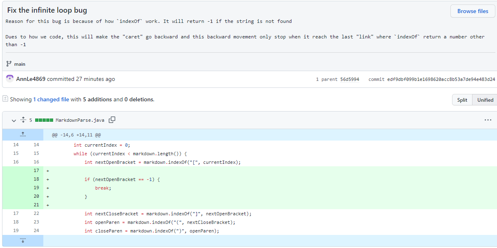
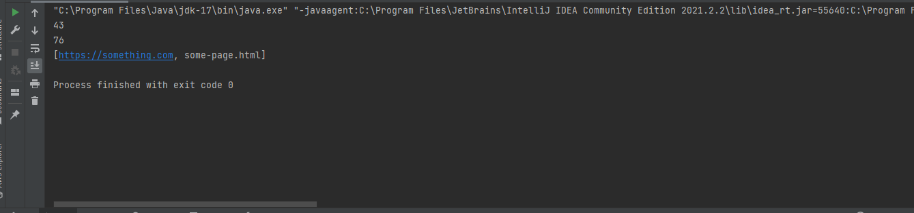
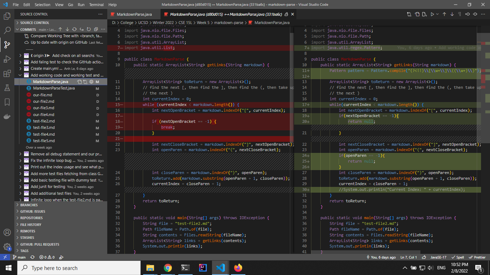
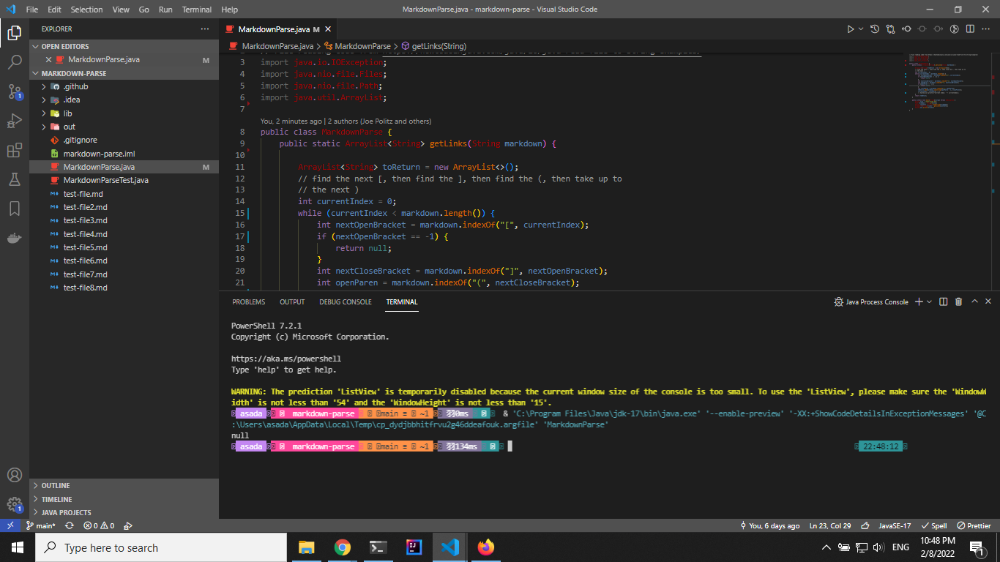
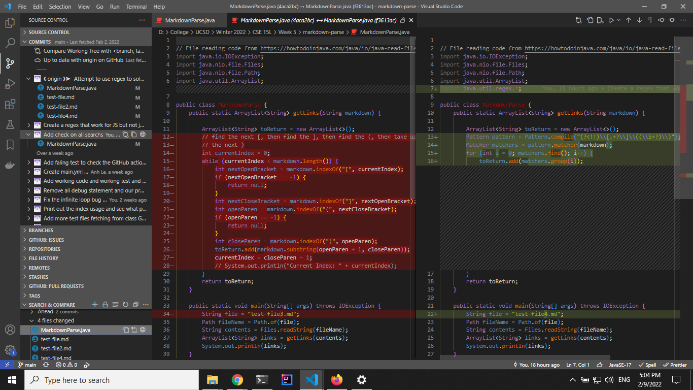
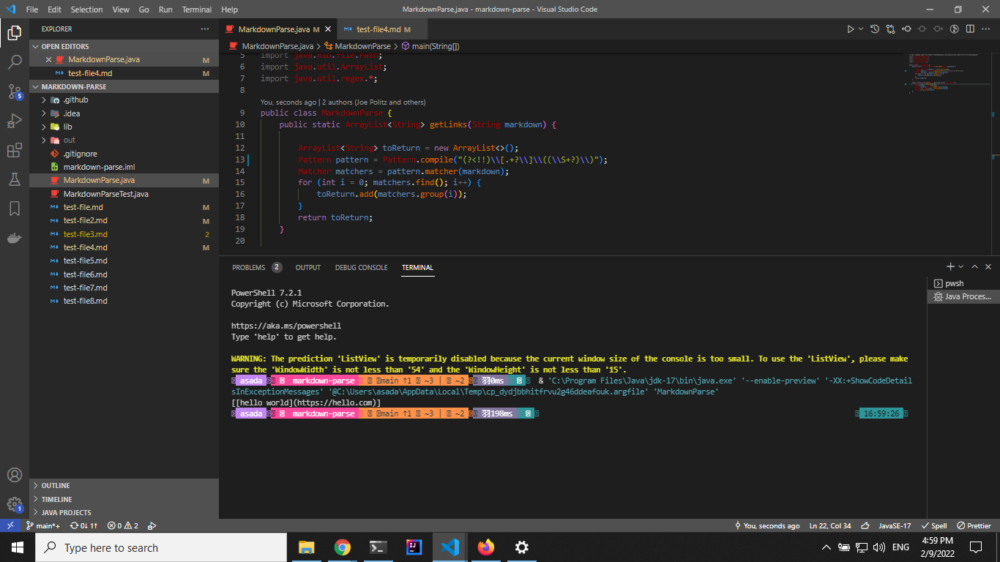

# Lab 4 report

## Table of content

- [Test file used](#test-file-used)
- [First code change](#first-code-change)
- [Second code change](#second-code-change)
- [Third code change](#third-code-change)

## Test file used

We use [this test file](test-file2.md) as the input. This is the test file that create an unexpected outcome and prompt us to make change to our code

This test file is copy from this [original repo](https://github.com/ucsd-cse15l-w22/markdown-parse)

## First code change

**Initial behavior**: when use this test file as input, the program enter an infinite loop. We must force the program to terminate to exit this loop

**Expected behavior**: the program print out

    ```bash
    [https://something.com, some-page.html]
    ```

**Brief description of the change**: I added a print statement to print out the current index used by the program. This is to track down how the program behave



**Actual output**: see the loop of "43 76" indefintely



**Potential reason for problem**: look like our program somehow keep going backward and use the last "link" in our program instead of terminating it. We can first add another statement to our code to ensure that the program keep using the last "link". It probably has something to do with how the `indexOf` works

## Second code change

**Initial behavior**: when use this test file as input, the program enter an infinite loop. We must force the program to terminate to exit this loop

**Expected behavior**: the program print out

    ```bash
    [https://something.com, some-page.html]
    ```

**Brief description of the change**: I added check statement to see whether the first search return -1 or not. If it return -1 we shall stop the while loop



**Actual output**: actually work, no longer has infinite loop. In fact, this is very close to our expected output



**Explanation**: the `indexOf` return -1 if it cannot find the sequence. This will make the caret go backward instead of going forward if we still have some content after the last "link". I fixed this behavior by adding a check on the first search so that, if it cannot find the first parenthesis, it means no more link exist and the program shall stop

## Third code change

**Initial behavior**: when use this test file as input, the program print expected output and some statement we print for debug purpose. We shall remove these debug statement and see whether our program still work or not

**Brief description of the change**: remove the `println` statement inside `getLinks` method



**Actual output**: actually work, no longer has infinite loop. In fact, this is very close to our expected output



**Explanation**: not much to say here. But sometimes a debug statement is the difference between a working and a fail program (like in case of race condition)
